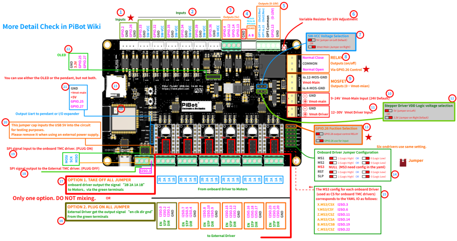

# Pen Plotter

Now connected to local wifi. Can be reached at http://fluidnc.local/

## Control Board

PiBot FluidNC ESP32 GRBL Laser CNC Controller V4.96 Pro
https://www.pibot.com/pibot-fluidnc-grbl-cnc-controller-v4-9

Installation and introduction guide:
https://wiki.pibot.com/doku.php?id=pibot_cnc_laser_series:v496_pro:introduction:start

Diagram:

### Connecting components

_Stepper motor_

- white - 2B, yellow - 2A, blue - 1B, red - 1A
- kh24hm2b045b stepper motor nidec
- [Datasheet](701905_87902_datasheet_en.pdf)

_Servo motor_

- Luxoparts S3003
- [Datasheet](0900766b80112640.pdf)
